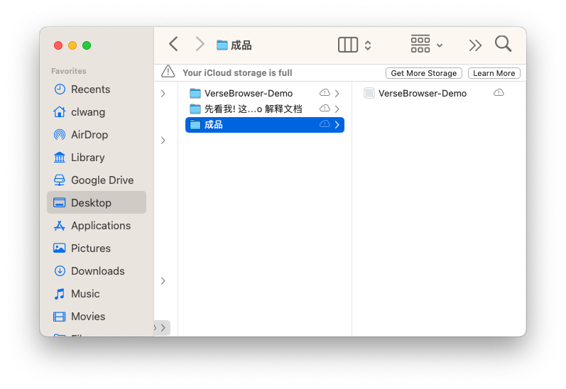
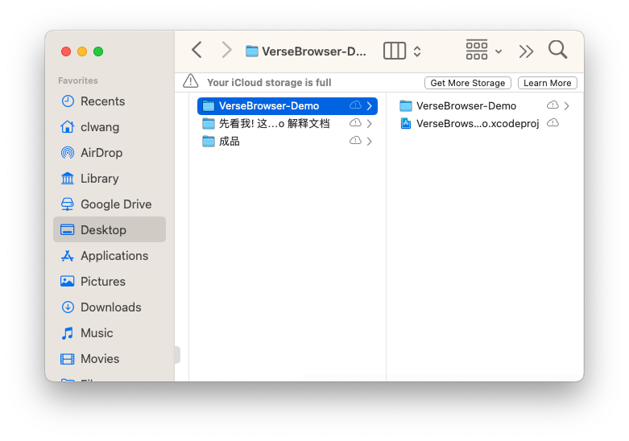
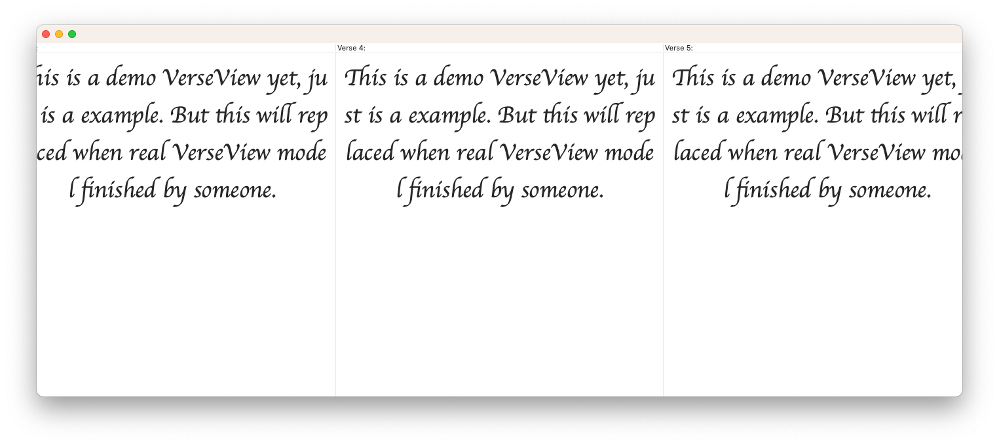
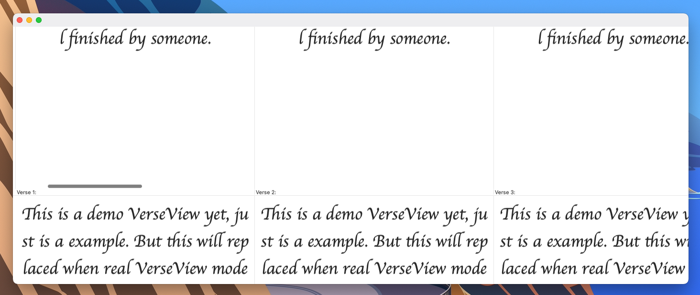
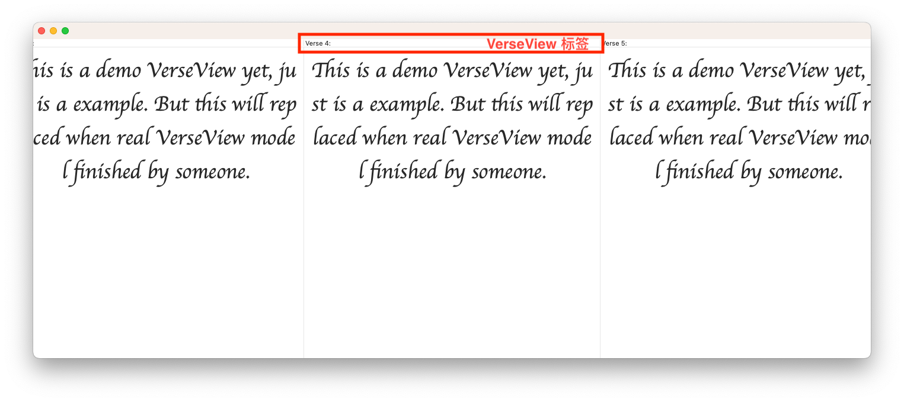
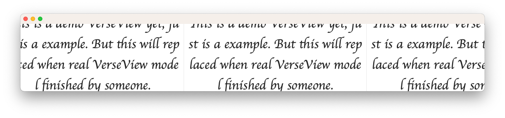

# Verse Browser -- Demo

---------------------------

此文档用于解释 VerseBrowser Demo 的具体表现，以完整预览其展示的所有功能效果。

###### 此程序和 xcode 项目都位于此文件包中：

在 “成品” 文件夹中，有已经构建打包好的 Demo，可以直接运行预览效果。

###### 若要查看其 xcode 开发项目，在这个文件夹中：

若你要自行构建应用程序，可能会因为环境不同出现一些错误。(这毕竟是一个 Demo 项目，在这一方面未做考虑)

所以，推荐直接打开已构建好的应用程序进行浏览

-------------

### 介绍

这个 Demo 实现了在解释文档中列出的技术目标以及功能，包括：

- 上下两指滑动手势切换并列经文组
- 左右两指滑动手势浏览上下经文
- 自动追加、自动刷新效果
- VerseView 拖动排序

下面看看此 Demo 带来的演示：

-----------------------

##### 上下两指滑动手势--切换并列经文组

通过上下两指 swipe 来切换并列经文组：

会出现如此滑动切换效果

不要介意第二张截图中窗口下面的背景变成了彩色，这是后期裁剪时产生的，并不是程序效果。~~不过，想要截出这张图是真的不容易。。。。。。~~

##### 左右两指滑动手势浏览上下经文

不必多说，自己操作即可

##### 自动追加、自动刷新效果

当你左右滑动触碰到最后一个 VerseView 的边缘时，程序会根据滑动的方向，向其边缘追加一个 VerseView 同时删除反方向尾端的一个 VerseView(这是为了保证内存中只放置 x 个 VerseView，在此 Demo 中，x = 20)。

但是，你会发现当你在滑动时，VerseView 标签始终从 1 到 20，这是因为出于简化程序的目的，这个 Demo 并没有实现该功能。所以，当向前追加一个 VerseView 时，这个新追加的 VerseView 的标签将被赋为 Verse 1，而原先的第一个 VerseView (也就是目前的第二个)的标签会被赋为 Verse 2。

当上下滑动以切换经文组时，程序会进行判断是否需要追加

具体实现方式是：程序内部维护一个数组，每次切换经文组时都会检查此数组是否已经到达数组边缘。若是，则向数据源请求数据并删除此数组尾部的一个数据，否则直接显示下一个 VerseStackView。这样实现，保证内存中只放置 y 个 VerseStackView (在此 Demo 中，y = 3)。

##### VerseView 拖动排序

不必多说，拖动 VerseView 标签，你便能看到其拖拽排序效果。

----------------

#### 补充说明

此 Demo 仅仅是个演示，所以只要求代码尽量精简，编码尽量迅速，只保证其上的 4 个功能可预览即可。所以，此程序中有一些 bug，因时间和成本原因不再修复。这些已知的 Bug 包括：

- 当自动追加效果产生时，VerseView 标签不会自动调整，即我在上面所提到的。

- 将 VerseStackView 的内容滚动到窗口中间(不完全展示，见下图示例)，若此时触碰边缘以触发自动追加效果，ScrollView 的回跳行为不正确，另外，程序可能陷入死循环。

  

- 当通过拖动窗口边缘改变窗口大小使内容到达边缘时，VerseStackView 的不会自动追加新的 VerseView。